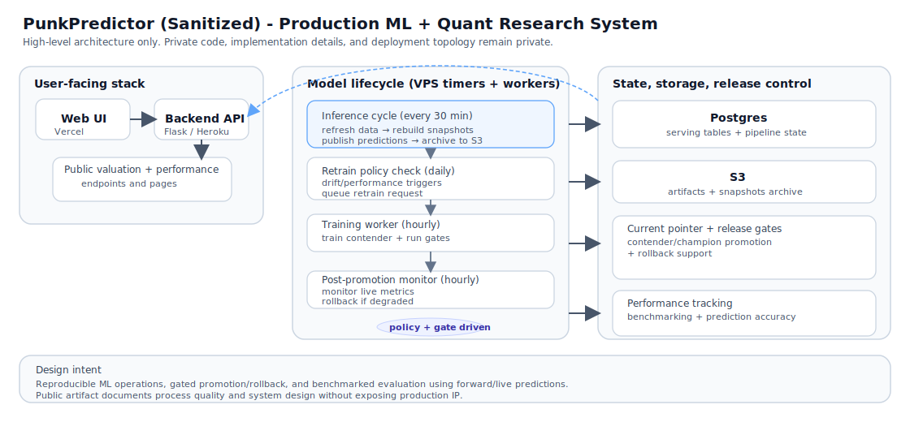

# PunkPredictor Case Study (Sanitized)

Public case study of the production ML and quant research system behind [PunkPredictor](https://punkpredictor.xyz), a CryptoPunks valuation platform.

Last updated: Feb 2026.

## Start Here

- [Architecture](docs/architecture.md) — component map, layer responsibilities, and design rationale
- [Operations](docs/operations.md) — scheduled jobs and release lifecycle
- [Evaluation](docs/evaluation.md) — promotion gates and benchmarking philosophy

This repository intentionally excludes private source code and secrets. It documents the system design, release workflow, evaluation discipline, and operational decisions used in production.

## System Overview

PunkPredictor combines a public web app, backend APIs, and a DB-first model pipeline:

- **Frontend**: static pages + API proxy handlers (Vercel)
- **Backend**: Flask API serving production endpoints (Heroku)
- **Model pipeline**: scheduled inference, retrain policy checks, contender training, promotion/rollback
- **Infra**: VPS timers/services for nowcasting and model lifecycle workers
- **Storage**: Postgres + S3 artifact/snapshot archiving

The production monorepo is private. This case study provides a concrete artifact that demonstrates:

- end-to-end production ML ownership
- reproducible training and inference workflows
- release gates (contender/champion promotion + rollback)
- scheduled operations and deployment automation
- quant-style evaluation against a passive benchmark

It evolved from the earlier public prototype repo ([Predict-CryptoPunks-Price](https://github.com/ennriqe/Predict-CryptoPunks-Price)) into a niche live product with real users and ongoing production operations.

## Production Lifecycle (High Level)

Four independent timer-driven loops run on VPS:

**Inference cycle (every 30 min)**
1. Fresh sales, market, and helper tables are updated
2. Snapshot + nowcasts are rebuilt and published via a pointer-swap table
3. Artifacts/snapshots are archived to S3

**Retrain policy check (daily)**
4. Drift and performance conditions are evaluated; a training request is enqueued when thresholds are met

**Training queue worker (hourly)**
5. A queued training request is claimed and run on ephemeral compute
6. The contender is evaluated against promotion gates and a promotion decision is recorded

**Post-promotion monitor (hourly)**
7. The promoted model's live behavior is tracked; rollback triggers can revert pointers automatically

## Public Metrics (Example Snapshot Methodology)

Metrics evolve as new sales complete. The examples below describe the evaluation style and a representative public snapshot methodology (see `/docs/metrics.md`).

### Valuation quality (CV-aligned summary, Feb 2026)
Live: [punkpredictor.xyz/performance](https://punkpredictor.xyz/performance)
- 2,807 sales
- MAPE 6.92%
- Median APE 4.68%
- Signed bias -0.80%

### Strategy-style validation (CV-aligned summary, Feb 2026)
Live: [punkpredictor.xyz/backtest](https://punkpredictor.xyz/backtest)
- Forward/live predictions only (not retroactive)
- Sharpe 2.23 vs 1.57 passive baseline
- Max drawdown 16.32% vs 41.02% passive baseline

## What Is Intentionally Omitted

- private source code (frontend/backend/model implementation)
- secrets, infrastructure credentials, and deployment targets
- proprietary feature engineering details and exact data contracts
- operational commands that would reveal internal topology

## Repo Contents

- `docs/architecture.md` - sanitized architecture diagram and component responsibilities
- `docs/operations.md` - scheduled jobs, deployment flow, and release lifecycle
- `docs/evaluation.md` - validation philosophy and gating principles
- `docs/metrics.md` - example public metrics snapshot and interpretation notes

## Contact / Context

If you are reviewing this as part of a hiring process, the goal is to show engineering and research process quality, not expose production IP. I can walk through implementation details live.
