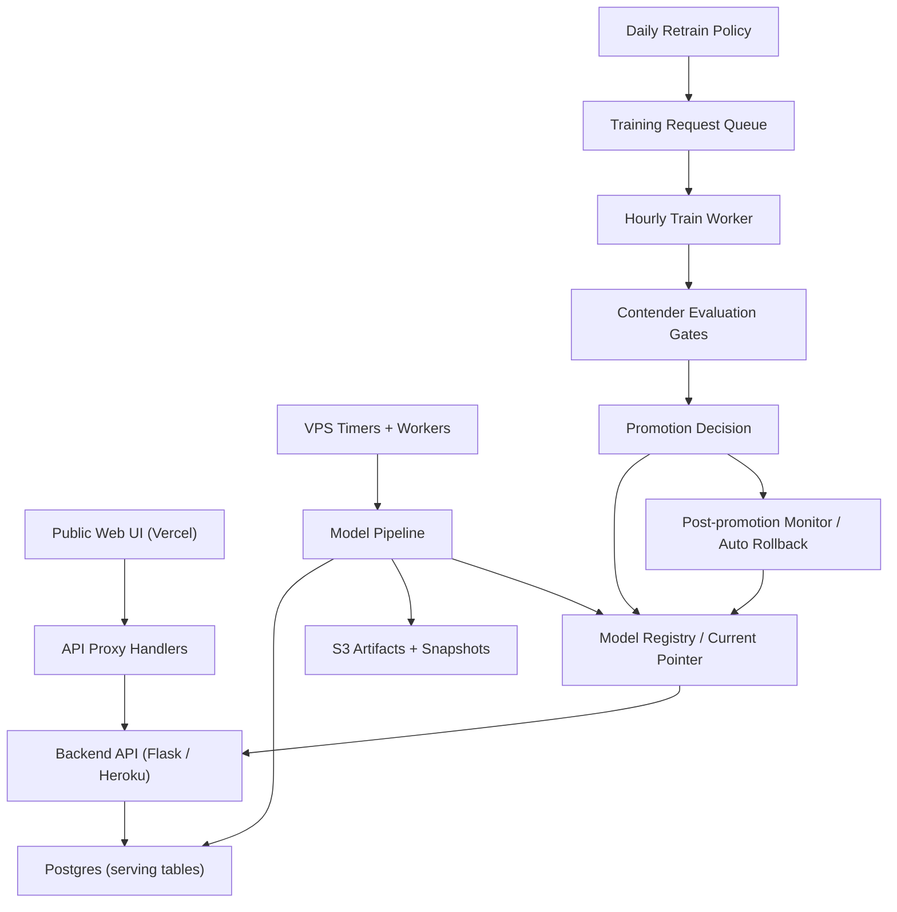

# Architecture (Sanitized)

## Component Map

## Responsibilities by Layer

### Frontend / Web
- Serves public pages and user-facing valuation/performance views ([punkpredictor.xyz/performance](https://punkpredictor.xyz/performance), [/backtest](https://punkpredictor.xyz/backtest))
- Uses API proxy handlers to keep client interactions simple and stable

### Backend API
- Serves production endpoints consumed by frontend pages
- Reads model outputs and compatibility/performance tables
- Exposes public metrics and valuation results

### Model Pipeline
- DB-first feature/snapshot workflows
- scheduled nowcast generation
- training and evaluation runs
- contender registration and gate evaluation
- model pointer promotion/rollback
- S3 archiving of artifacts and snapshots

### Infra / Scheduling
Production jobs are timer-driven rather than notebook-driven:
- nowcast cycle (every 30 minutes)
- retrain policy evaluation (daily)
- training queue worker (hourly)
- promoted-model monitoring (hourly)

## Design Choices That Matter

- **Pointer swap publishing**: reduces downtime/race conditions when refreshing current predictions
- **DB-first pipeline**: improves reproducibility and compatibility between research and serving layers
- **Queued training requests**: decouples retrain policy detection from expensive training execution
- **Promotion gates + rollback**: avoids automatic degradation from a single bad retrain
